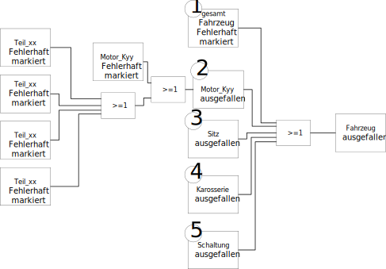
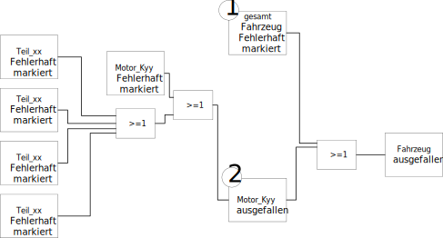

```{r setup, include=FALSE}

knitr::opts_chunk$set(echo = TRUE, eval = TRUE)

```

**Aufgabenstellung**

Wir sind Mitarbeiter eines fiktiven großen Automobilkonzerns, der unter zwei Automobilmarken, “OEM1” und “OEM2”, mehrere Fahrzeugtypen herstellt. Die Zulieferkette setzt sich aus zwei Instanzen zusammen: den Teilelieferanten und den Komponentenlieferanten. Das Produktionswerk verbaut die Komponenten in die jeweiligen Fahrzeuge. Momentan versuchen die Automobilhersteller, trotz negativer Berichterstattung über Dieselfahrzeuge, Kunden für Autos mit Dieselmotoren zu gewinnen. Ein oft verwendetes Argument ist **die Langlebigkeit von Dieselmotoren, die deutlich größer als die Lebensdauer der Benzinmotoren sein soll.**  Das Management beauftragt Sie, diese Behauptung zu überprüfen um mit der Aussage künftig werben zu können. Überprüfen Sie die Aussage über die Langlebigkeit von Dieselmotoren durch einen Vergleich mit Benzinmotoren. Überprüfen Sie die Aussage über die Langlebigkeit von Dieselmotoren durch einen Vergleich mit Benzinmotoren. Ermitteln Sie den Zeitraum zwischen Zulassungsdatum und Fehlerdatum aller Fahrzeuge, getrennt nach Motorisierungsart und Fahrzeugart. Visualisieren Sie Ihre Ergebnisse entsprechend Ihrer Zielgruppe. Ermöglichen Sie einen Vergleich zwischen den Fahrzeugtypen.

**Visualisierung**

A: Ein Balkendiagramm, das die relativen Fehlerhäufigkeiten aller Motoren, getrennt in Benzin- und Dieselantrieb, darstellt. Das Diagramm muss interaktive Elemente enthalten. Der Produktionszeitraum der Fahrzeuge muss durch den Nutzer variabel eingrenzbar sein.

B: Pro Fahrzeugtyp jeweils einen Boxplot für Varianten mit Dieselmotor und einen Boxplot für Varianten mit Benzinmotor. Die Boxplots beziehen sich dabei auf das Zeitintervall zwischen Zulassung eines Fahrzeugs und Fehlerdatum der Fahrzeuge. Wichtige Kennzahlen müssen interaktiv ablesbar sein. Die Fahrzeugtypen sollen an- und abwählbar sein. Alle Fahrzeugtypen von OEM1 und OEM2 sollen mit einem Klick an- und abwählbar sein. Der für das Balkendiagramm ausgewählte Produktionszeitraum soll auch hier angewendet werden.

# Importieren der Daten
## Laden und geg. Installieren notwendiger Bibliotheken

```{r packages, include=TRUE, message = FALSE}

if(!require(plotly)){
  install.packages("plotly")
}
library(plotly)

if(!require(shinyWidgets)){
  install.packages("shinyWidgets")
}
library(shinyWidgets)

if(!require(shinythemes)){
  install.packages("shinythemes")
}
library(shinythemes)

if(!require(DT)){
  install.packages("DT")
}
library(DT)

if(!require(data.table)){
  install.packages("data.table")
  # für die Verwendung von fread()
  library(data.table)
}


if(!require(tidyverse)){
  install.packages("tidyverse")
  library(tidyverse)
}


if(!require(shiny)){
  install.packages("shiny")
  library(shiny)
}


if(!require(plyr)){
  install.packages("plyr")
  require(plyr)
}


if(!require(lubridate)){
  install.packages("lubridate")
  require(lubridate)
}


if(!require(eply)) {
  install.packages("eply")
  require(eply)
}


```


Aus die Aufgabenstellung gibt es solche Annahme:
$$
Lebensdauer=  Fehlerdatum - Zulassungsdatum
$$

## Relevante Daten

Zuerst wurde/wird es analysiert, welche daten relevant sind. Dieses Verfahren hängt von den folgenden drei Aufgaben und weiteren detallierten Anforderungen des Inhalts und der Eigenschaften der Shiny-Applikation. Darüber hinaus hängen die relevanten Daten mit den Dateien zusammen, die nicht nur die unterschiedlichen Motorentypen als ganze Systeme sondern auch die Einzelteile dieser Motoren beschreiben. 

1. Überprüfen Sie die Aussage über die Langlebigkeit von Dieselmotoren durch einen Vergleich mit Benzinmotoren.
2. Ermitteln Sie den Zeitraum zwischen Zulassungsdatum und Fehlerdatum aller Fahrzeuge, getrennt nach Motorisierungsart und Fahrzeugart.
3.  Visualisieren Sie Ihre Ergebnisse entsprechend Ihrer Zielgruppe. Ermöglichen Sie einen Vergleich zwischen den Fahrzeugtypen.


Die für die Analyse nötwendigen Parameter sind wie folgend aufgelistet :


- Fehlerdatum  der Fahrzeuge, die wegen eines fehlerhaften Motors, defekt geworden sind 
- Zulassungsdatum der oben geschriebenen Fahrzeuge
- Motorisierungsart dieser Fahrzeuge (Mit Diesel oder Benzin angetrieben) 
- Fahrzeugart(Typ11,Typ12, Typ21 oder Typ22)
- Fahrzeugmarke (OEM1 oder OEM2)
- Fehlermeldung aller Motoren (Fehlerhaft oder nicht) einschließlich Fehlermeldung ihrer Komponente 


| Nr.  | Faktoren                  | directory name       | file name                               | Spezifikation |
| ---- | ------------------------- | -------------------- | --------------------------------------- | ------------- |
| 1    | Zulassungsdatum           | "./Data/Zulassungen" | "Zulassungen_alle_Fahrzeuge.csv"        |               |
| 2    | Fehlerdatum der Fahrzeuge | "./Data/Fahrzeug"    | "Fahrzeuge_OEM1_Typ11.csv"              | Typ 11        |
| 3    |                           |                      | "Fahrzeuge_OEM1_Typ12.csv"              | Typ 12        |
| 4    |                           |                      | "Fahrzeuge_OEM2_Typ21.csv"              | Typ 21        |
| 5    |                           |                      | "Fahrzeuge_OEM2_Typ22.csv"              | Typ 22        |
| 6    | Motoren der Fahrzeuge     | "./Data/Fahrzeug"    | "Bestandteile_Fahrzeuge_OEM1_Typ11.csv" | Typ 11        |
| 7    |                           |                      | "Bestandteile_Fahrzeuge_OEM1_Typ12.csv" | Typ 12        |
| 8    |                           |                      | "Bestandteile_Fahrzeuge_OEM2_Typ21.csv" | Typ 21        |
| 9    |                           |                      | "Bestandteile_Fahrzeuge_OEM2_Typ22.csv" | Typ 22        |
| 10   | Fehlerdatum der Motoren   | "./Data/Komponente"  | "Komponente_K1BE1.csv"                  |               |
| 11   |                           |                      | "Komponente_K1BE2.csv"                  |               |
| 12   |                           |                      | "Komponente_K1DI1.csv"                  |               |
| 13   |                           |                      | "Komponente_K1DI2.txt"                  |               |
| 14   | Bestandteile der Motoren  | "./Data/Komponente"  | "Bestandteile_Komponente_K1BE1.csv"     |               |
| 15   |                           |                      | "Bestandteile_Komponente_K1BE2.csv"     |               |
| 16   |                           |                      | "Bestandteile_Komponente_K1DI1.csv"     |               |
| 17   |                           |                      | "Bestandteile_Komponente_K1DI2.csv"     |               |
| 18-28| Einzelteile der Motoren   | "./Data/Einzelteile" | "Einzelteil_T0X.txt"                    | X = 01 bis 10 |

## Einlesen der Rohdaten

**Einzelteile 01 bis 10**

Obwohl es 38 Einzelteile gibt, werden nur die Dateien mit Data zu den Einzelteilen 1-10 eingelesen, weil sie die Bestandteile der unterschiedlichen Motoren sind. Die Dateien, die ausführliche Informationen zum Einzelteil 1, 2, 3, 7 und 9 enthalten, haben so ein Format, dass es keine entsprechende Funktion gibt, die nach dem Einlesen unmittelbar aus dem original Format eine übersichtliche Struktur erzeugen würde. Deswegen werden die Dateien auf die folgende Weise modifiziert. Die Data in der Dateien werden in übersichtliche Zeile nach der Analysierung ihrer Struktur organisiert und die Field Parameters werden simplifiziert, was es ermöglicht, die Dateien durch eine Funktion wie Fread einzulesen, um eine Data Frame zu erzeugen. 

*Einzelteil 01*

```{r Einzelteil_01, message = FALSE, warning = FALSE}
# die Daten im Einzelteil_T01.txt habe fogende Merkmal:
#   -die 2. Spalt von Oberservation ist überschüssig , 3. Spalt ist  die echte ID_T01
#   -Trennzeichen zwischen Spalten ist  " | | " , und in  ASCII(hex) ist \x20\x7c\x20\x7c\x20 
#   -Trennzeichen zwischen Zeilen ist " "(einzel Leerzeichen) und in  ASCII(hex) ist \x20
#
#Fehler :
#   -Zeichen "Fahrleistung" und  "A" ist Bestandteil von Datensatz (NA), bitte vermeiden sie als Pattern zu nutzen 
#   -bei ersetzen durch "str_replace_all" hast du falsch Pattern genutzt. einstellige Pipeline "|" bedeutet logische operation "Oder", das Zeichen "\" kann wörtliche Bedeutung einer Stelle nutzen. deswegen die richtige Format von " | | "ist  " \\| \\| "

Einzelteil_T01_roh <- read_file("Data/Einzelteil/Einzelteil_T01.txt") %>%
  str_replace_all(" \\| \\| " , ",") %>%
  str_replace_all(" ", "\n")%>%
  
  fread()

```
 
*Einzelteil 02*

```{r Einzelteil_T02, message = FALSE, warning = FALSE}

Einzelteil_T02_roh <- read_file("Data/Einzelteil/Einzelteil_T02.txt") %>%
  str_replace_all("\t","\n") %>%
  str_replace_all("  ",",") %>%

  fread()

```

*Einzelteil 03*

```{r Einzelteil_T03, message = FALSE, warning = FALSE}
# die unsichtbare Zeichen hat ASCII-Code \x0b  ,ist vertical tab
# das reserviert Zeichen "|" soll interperiert als normaler Zeichen  

Einzelteil_T03_roh <- read_file("Data/Einzelteil/Einzelteil_T03.txt") %>%
  str_replace_all("\\|",",") %>%
  str_replace_all("\x0b","\n") %>%
  
  fread()

```
 
*Einzelteil 04 - 06* 

Dank des Formats dieser Dateien können sie einfach durch fread eingelesen werden.

```{r Einzelteil_T04_5_6, message = FALSE, warning = FALSE}

Einzelteil_T04_roh <- fread("Data/Einzelteil/Einzelteil_T04.csv")
Einzelteil_T05_roh <- fread("Data/Einzelteil/Einzelteil_T05.csv")
Einzelteil_T06_roh <- fread("Data/Einzelteil/Einzelteil_T06.csv")

```

*Einzelteil 07*

```{r Einzelteil_T07, message = FALSE, warning = FALSE}

# Trennzeich zwischen Zeilen korrigiert werden
Einzelteil_T07_roh <- read_file("Data/Einzelteil/Einzelteil_T07.txt") %>%
  str_replace_all("\"\"","\"\n\"") %>%

  fread(sep="\t")

```

*Einzelteil 08* 

Dank des Formats dieser Datei kann sie einfach durch fread eingelesen werden.

```{r Einzelteil_T08, message = FALSE, warning = FALSE}

Einzelteil_T08_roh <- fread("Data/Einzelteil/Einzelteil_T08.csv")

```

*Einzelteil 09*

```{r Einzelteil_T09, message = FALSE, warning = FALSE}
#\v für ASCII-Code \x0b
Einzelteil_T09_roh <- read_file("Data/Einzelteil/Einzelteil_T09.txt") %>%
  str_replace_all("\v","\n") %>%
  
  fread(sep="\\")

```

*Einzelteil 10*

Dank des Formats dieser Datei kann sie einfach durch fread eingelesen werden.

```{r Einzelteil_T10, message = FALSE, warning = FALSE}

Einzelteil_T10_roh <- fread("Data/Einzelteil/Einzelteil_T10.csv")

```


**Fahrzeuge und ihre Bestandteile**

*Fahrzeug 11*

Dank des Formats dieser Dateien können sie einfach durch fread eingelesen werden.

```{r Fahrzeug_11, message = FALSE, warning = FALSE}

Fahrzeuge_OEM1_Typ11_roh <- fread("Data/Fahrzeug/Fahrzeuge_OEM1_Typ11.csv")
Bestandteile_Fahrzeuge_OEM1_Typ11_roh <- read_csv2("Data/Fahrzeug/Bestandteile_Fahrzeuge_OEM1_Typ11.csv")

```

*Fahrzeug 12*

Dank des Formats dieser Dateien können sie einfach durch fread eingelesen werden.

```{r Fahrzeug_12, message = FALSE, warning = FALSE}

Fahrzeuge_OEM1_Typ12_roh <- fread("Data/Fahrzeug/Fahrzeuge_OEM1_Typ12.csv")
Bestandteile_Fahrzeuge_OEM1_Typ12_roh <- read_csv2("Data/Fahrzeug/Bestandteile_Fahrzeuge_OEM1_Typ12.csv")

```

*Fahrzeug 21*

Dank des Formats dieser Dateien können sie einfach durch fread eingelesen werden.

```{r Fahrzeug_21, message = FALSE, warning = FALSE}

Fahrzeuge_OEM2_Typ21_roh <- fread("Data/Fahrzeug/Fahrzeuge_OEM2_Typ21.csv")
Bestandteile_Fahrzeuge_OEM2_Typ21_roh <- read_csv2("Data/Fahrzeug/Bestandteile_Fahrzeuge_OEM2_Typ21.csv")

```

*Fahrzeug 22*

Dank des Formats dieser Dateien können sie einfach durch fread eingelesen werden.

```{r Fahrzeug_22, message = FALSE, warning = FALSE}

Fahrzeuge_OEM2_Typ22_roh <- fread("Data/Fahrzeug/Fahrzeuge_OEM2_Typ22.csv")
Bestandteile_Fahrzeuge_OEM2_Typ22_roh <- fread("Data/Fahrzeug/Bestandteile_Fahrzeuge_OEM2_Typ22.csv")

```


**Komponente(Motoren) und ihre Bestandteile**

*Motor K1BE1*

Dank des Formats dieser Dateien können sie einfach durch fread eingelesen werden.

```{r Motor_K1BE1, message = FALSE, warning = FALSE}

Komponente_K1BE1_roh <- fread("Data/Komponente/Komponente_K1BE1.csv")
Bestandteile_Komponente_K1BE1_roh <- read_csv2("Data/Komponente/Bestandteile_Komponente_K1BE1.csv")

```

*Motor K1BE2*

Dank des Formats dieser Dateien können sie einfach durch fread eingelesen werden.

```{r Motor_K1BE2, message = FALSE, warning = FALSE}

Komponente_K1BE2_roh <- fread("Data/Komponente/Komponente_K1BE2.csv")
Bestandteile_Komponente_K1BE2_roh <- read_csv2("Data/Komponente/Bestandteile_Komponente_K1BE2.csv")

```

*Motor K1DI1*

Dank des Formats dieser Dateien können sie einfach durch fread eingelesen werden.

```{r Motor_K1DI1, message = FALSE, warning = FALSE}

Komponente_K1DI1_roh <- fread("Data/Komponente/Komponente_K1DI1.csv")
Bestandteile_Komponente_K1DI1_roh <- read_csv2("Data/Komponente/Bestandteile_Komponente_K1DI1.csv")

```

*Motor K1DI2*

Folgende Datei wird so modifiziert, dass eine einlesbare Struktur generiert wird, mit der eine Funktion wie Fread eine Data Frame erstellen kann. 

```{r Motor_K1DI2_1, message = FALSE, warning = FALSE}

#Spalte V1 ist wiederholend zu X1
Komponente_K1DI2_roh <- read_file("Data/Komponente/Komponente_K1DI2.txt") %>%
  str_replace_all("\t","\n") %>%
  
  fread(sep="\\")

```

Dank des Formats folgender Datei kann sie einfach durch fread eingelesen werden.

```{r Motor_K1DI2_2, message = FALSE, warning = FALSE}

Bestandteile_Komponente_K1DI2_roh <- read_csv2("Data/Komponente/Bestandteile_Komponente_K1DI2.csv")

```


**Zulassungen**

Dank des Formats dieser Datei kann sie einfach durch fread eingelesen werden.

```{r Zulassungen, message = FALSE, warning = FALSE}

Zulassungen_alle_Fahrzeuge_roh <- read_csv2("Data/Zulassungen/Zulassungen_alle_Fahrzeuge.csv")

```


# Datenaufbereitung

Die durch die Importierung resultierenden Datensätze enthalten mehrere Variablen, die völlig irrelevant bezüglich des Zieles der CaseStudy sind, so wie Spalten, die nach der Importierung generiert wurden, die überhaupt keine Information haben. Entsprechend werden diese Variablen und Spalten entfernt und das Format der relevanten Variablen geändert, falls notwendig. 


## Datenaufbereitung der Einzelteilen

Die Tabellen aller in Motor verbauten Teilen weisen zwei unterschiedliche merkmale auf:

- Merkmal1 :dupliziert Spalten wegen unterschiedlich Herstellernummer und Werksnummer

Betroffend sind Einzelteile: T01,T02, T05 und T09

```{r Teil_Merkmal1, message = FALSE, warning = FALSE}

str(Einzelteil_T01_roh)
summary(Einzelteil_T01_roh)
str(Einzelteil_T02_roh)
summary(Einzelteil_T02_roh)
str(Einzelteil_T05_roh)
summary(Einzelteil_T05_roh)
str(Einzelteil_T09_roh)
summary(Einzelteil_T09_roh)

# Deswegen für Aufbereitung der Rohdaten mit Merkmal1 wird so eine Funktioin definiert.

Tabelle_mit_duplizierte_Spalten_Aufbereiten<-function(dat){
  
  Id_Names_Index<- str_which(colnames(dat),regex("ID"))
  Id_Names<-colnames(dat)[Id_Names_Index]
  
  Produktionsdatum_Names_Index<- str_which(colnames(dat),regex("Produktionsdatum"))
  Produktionsdatum_Names<-colnames(dat)[Produktionsdatum_Names_Index]
  
  
  Fehlerhaft_Names_Index<- str_which(colnames(dat),regex("t(\\.x)?(\\.y)?\\b"))
  Fehlerhaft_Names<-colnames(dat)[Fehlerhaft_Names_Index]
  
  Fehlerhaft_Datum_Names_Index<- str_which(colnames(dat),regex("t_D"))
  Fehlerhaft_Datum_Names<-colnames(dat)[Fehlerhaft_Datum_Names_Index]
  
  
  #zu erst wurde nur relevante Spakten gewählt
  Relevant_Names<-c(Id_Names,
                    Produktionsdatum_Names,
                    Fehlerhaft_Names,
                    Fehlerhaft_Datum_Names)
  
  dat<-dat%>%
    dplyr::select(Relevant_Names)%>%
  
  #Bevor wir    tidyr::unite() nutzenm betroffende Spalten werden als Character gesetzt
    
    dplyr::mutate_all(base::as.character)%>%
    
  #Zusammensetzen von glechgestellte Spalten
    
    tidyr::unite(IDNummer,Id_Names,na.rm=TRUE)%>%
    tidyr::unite(Produktionsdatum,Produktionsdatum_Names,na.rm=TRUE)%>%
    tidyr::unite(Fehlerhaft,Fehlerhaft_Names,na.rm=TRUE)%>%
    tidyr::unite(Fehlerhaft_Datum,Fehlerhaft_Datum_Names,na.rm=TRUE)%>%
    
  #Umwandeln der Datentyp
    mutate(Produktionsdatum=lubridate::as_date(Produktionsdatum))%>%
    mutate(Fehlerhaft_Datum=lubridate::as_date(Fehlerhaft_Datum))%>%
    mutate(Fehlerhaft=base::as.integer(Fehlerhaft))%>%
    mutate(Fehlerhaft=base::as.logical(Fehlerhaft))
  
  
  
  
}


Einzelteil_T01<-Tabelle_mit_duplizierte_Spalten_Aufbereiten(Einzelteil_T01_roh)
Einzelteil_T02<-Tabelle_mit_duplizierte_Spalten_Aufbereiten(Einzelteil_T02_roh)
Einzelteil_T05<-Tabelle_mit_duplizierte_Spalten_Aufbereiten(Einzelteil_T05_roh)
Einzelteil_T09<-Tabelle_mit_duplizierte_Spalten_Aufbereiten(Einzelteil_T09_roh)

```

- Merkmal2 :kein duplizierte Spalten,aber Produktionsdatum sind als eine Ganzzahl angegeben, die eigentlich den Zeitabstand zu Originsdatum `Origin` bedeutet

Betroffend sind Einzelteile: T03,T04,T06,T07,T08 und T10

```{r Teil_Merkmal2, message = FALSE, warning = FALSE}
str(Einzelteil_T03_roh)
summary(Einzelteil_T03_roh)
str(Einzelteil_T04_roh)
summary(Einzelteil_T04_roh)
str(Einzelteil_T06_roh)
summary(Einzelteil_T06_roh)
str(Einzelteil_T07_roh)
summary(Einzelteil_T07_roh)
str(Einzelteil_T08_roh)
summary(Einzelteil_T08_roh)
str(Einzelteil_T09_roh)
summary(Einzelteil_T09_roh)
str(Einzelteil_T10_roh)
summary(Einzelteil_T10_roh)


# Deswegen für Rohdaten mit Merkmal2 wird so eine Funktioin definiert.

Tabelle_mit_falschem_Produktionsdatum_Aufbereiten<-function(dat){
  
  Id_Name_Index<- str_which(colnames(dat),regex("ID"))
  Id_Name<-colnames(dat)[Id_Name_Index]
  
  Produktionsdatum_Name_Index<- str_which(colnames(dat),regex("Pro"))
  Produktionsdatum_Name<-colnames(dat)[Produktionsdatum_Name_Index]
  
  
  Fehlerhaft_Name_Index<- str_which(colnames(dat),regex("t\\b"))
  Fehlerhaft_Name<-colnames(dat)[Fehlerhaft_Name_Index]
  
  Fehlerhaft_Datum_Name_Index<- str_which(colnames(dat),regex("t_D"))
  Fehlerhaft_Datum_Name<-colnames(dat)[Fehlerhaft_Datum_Name_Index]
  
  
  #zu erst wurde nur relevante Spakten gewählt
  Relevant_Names<-c(Id_Name,
                    Produktionsdatum_Name,
                    Fehlerhaft_Name,
                    Fehlerhaft_Datum_Name,
                    "origin")
  dat<-dat%>%
    dplyr::select(Relevant_Names)%>%
  #Umbenennen
    dplyr::rename(IDNummer=eply::unquote(Id_Name)) %>%
    dplyr::rename(Produktionsdatum=eply::unquote(Produktionsdatum_Name)) %>%
    dplyr::rename(Fehlerhaft=eply::unquote(Fehlerhaft_Name)) %>%
    dplyr::rename(Fehlerhaft_Datum=eply::unquote(Fehlerhaft_Datum_Name)) %>%
  #Umwandeln der Datentyp
    dplyr::mutate(Fehlerhaft_Datum=lubridate::as_date(Fehlerhaft_Datum))%>%
    dplyr::mutate(Fehlerhaft=base::as.integer(Fehlerhaft))%>%
    dplyr::mutate(Fehlerhaft=base::as.logical(Fehlerhaft))%>%
  #Behandeln Produktionsdatum
    dplyr::mutate(Produktionsdatum=Produktionsdatum+lubridate::dmy(origin))%>%
  #Entfernung von Variable origin
    dplyr::select(-origin)


  
}
Einzelteil_T03<-Tabelle_mit_falschem_Produktionsdatum_Aufbereiten(Einzelteil_T03_roh)
Einzelteil_T04<-Tabelle_mit_falschem_Produktionsdatum_Aufbereiten(Einzelteil_T04_roh)
Einzelteil_T06<-Tabelle_mit_falschem_Produktionsdatum_Aufbereiten(Einzelteil_T06_roh)
Einzelteil_T07<-Tabelle_mit_falschem_Produktionsdatum_Aufbereiten(Einzelteil_T07_roh)
Einzelteil_T08<-Tabelle_mit_falschem_Produktionsdatum_Aufbereiten(Einzelteil_T08_roh)
Einzelteil_T10<-Tabelle_mit_falschem_Produktionsdatum_Aufbereiten(Einzelteil_T10_roh)


#remove unused variable

rm(Einzelteil_T01_roh)
rm(Einzelteil_T02_roh)
rm(Einzelteil_T03_roh)
rm(Einzelteil_T04_roh)
rm(Einzelteil_T05_roh)
rm(Einzelteil_T06_roh)
rm(Einzelteil_T07_roh)
rm(Einzelteil_T08_roh)
rm(Einzelteil_T09_roh)
rm(Einzelteil_T10_roh)

```


## Datenaufbereitung der Motoren

Die Tabellen aller Motoren weisen auch zwei unterschiedliche merkmale auf.Das ist ähnlich wie Merkmale von Einteilen.

- Merkmal1 :dupliziert Spalten wegen unterschiedlich Herstellernummer und Werksnummer

Betroffender ist  Motor: K1DI1

- Merkmal2 :kein duplizierte Spalten,aber Produktionsdatum sind als eine Ganzzahl angegeben, die eigentlich den Zeitabstand zu Originsdatum `Origin` bedeutet

Betroffende sind Motoren: K1DI2,K1BE1 und K1BE2


Die Relevante Spalten sind identisch,deswegen ist die vorher definierte Funktion wieder verwendbar

```{r Motoren, message = FALSE, warning = FALSE}


str(Komponente_K1DI1_roh)
summary(Komponente_K1DI1_roh)


str(Komponente_K1DI2_roh)
summary(Komponente_K1DI2_roh)
str(Komponente_K1BE1_roh)
summary(Komponente_K1BE1_roh)
str(Komponente_K1BE2_roh)
summary(Komponente_K1BE2_roh)


Komponente_K1DI1<-Tabelle_mit_duplizierte_Spalten_Aufbereiten(Komponente_K1DI1_roh)

Komponente_K1DI2<-Tabelle_mit_falschem_Produktionsdatum_Aufbereiten(Komponente_K1DI2_roh)

Komponente_K1BE1<-Tabelle_mit_falschem_Produktionsdatum_Aufbereiten(Komponente_K1BE1_roh)

Komponente_K1BE2<-Tabelle_mit_falschem_Produktionsdatum_Aufbereiten(Komponente_K1BE2_roh)


rm(Komponente_K1DI1_roh,
   Komponente_K1DI2_roh,
   Komponente_K1BE1_roh,
   Komponente_K1BE2_roh)


```

## Datenaufbereitung der Motorbestandteile
Bei Bestandteile von Motoren ist die eindeutige Beziehung zwischen Einzelteile und Motor wichtig. Ein bestimmiter Einzelteil muss genau eine Moter zugeordnet.Deswegen soll unsere Ideale Datenstruktur von Tabelle `Motorbestandteile` nur 2 Spalten `ID_Teil`,`ID_Motor` 

```{r Motor_Bestandteile, message = FALSE, warning = FALSE}

#Benzinmotern : K1BE1 
str(Bestandteile_Komponente_K1BE1_roh)
str(Bestandteile_Komponente_K1BE2_roh)
anyNA(Bestandteile_Komponente_K1BE1_roh)

#Benzinmotern :  K1BE2
str(Bestandteile_Komponente_K1BE2_roh)
str(Bestandteile_Komponente_K1BE2_roh)
anyNA(Bestandteile_Komponente_K1BE2_roh)

#Dieselmoteren :K1DI1 
str(Bestandteile_Komponente_K1DI1_roh)
str(Bestandteile_Komponente_K1DI1_roh)
anyNA(Bestandteile_Komponente_K1DI1_roh)

#Dieselmoteren :K1DI2
str(Bestandteile_Komponente_K1DI2_roh)
str(Bestandteile_Komponente_K1DI2_roh)
anyNA(Bestandteile_Komponente_K1DI2_roh)


Motorbestandteil_Aufbereitung<-function(dat){
  
  
  # die Muster "ID_T" kann alle Spaltenname ,die  Einzeilteilen relevanten sind, kriegen
  # z.B: 
  #     "ID_T1","ID_T2","ID_T3","ID_T4","ID_T5","ID_T6","ID_T7","ID_T8","ID_T9","ID_T10",
  #
  Id_Teile_Names_Index<- str_which(colnames(dat),regex("ID_T"))
  Id_Teile_Names<-colnames(dat)[Id_Teile_Names_Index]
  
  # die Muster "ID_K" kann alle Spaltenname ,die  Motor relevanten sind, kriegen
  # z.B: 
  #     "ID_K1DI1","ID_K1DI2","ID_K1BE1","ID_K1BE2"
  #
  Id_Motor_Name_Index<- str_which(colnames(dat),regex("ID_K"))
  Id_Moto_Name<-colnames(dat)[Id_Motor_Name_Index]
  
  
  Motor_Typ_geben <- function(ID_Motor) {
    if(stringr::str_detect(ID_Motor,regex("DI"))){
      return(as.factor("Dieselmotor"))
      
    }else if(stringr::str_detect(ID_Motor,regex("BE"))){
      return(as.factor("Benzinmotor"))
      
    }else{
      return(as.factor("unbekannt"))
    }
    
  }
  
  dat<-dat%>%
  #Auswahl relevanter Spalten
    dplyr::select(c(Id_Teile_Names,Id_Moto_Name))%>%
  #Umbennen auf "ID_Motor"
  #betroffend sind Spalten:
  #     "ID_K1DI1","ID_K1DI2","ID_K1BE1","ID_K1BE2"
    dplyr::rename(ID_Motor=eply::unquote(Id_Moto_Name))%>%
  #neue Spalten hinzufügen
  #Spaltenname (neue):
  #     "Motor_Typ":
  #                 Mögliche Werte sind "Benzinmotor","Dieselmotor" oder "unbekannt"
    dplyr::mutate(Motor_Typ=Motor_Typ_geben(ID_Motor))%>%
  #alle Spalten, die mit IDNummer von Einzelteile soll in eine Spalten integriert werden
  #Spaltenname (neue)
  #     "ID_Teil":
  #                 Mögliche werte sind "x-xxx-xxx-xxxx",x sind Ziffer
  #     "Teil_Typ":
  #                 Mögliche werte sind "ID_Tx",x sind Ziffer
    tidyr::gather(Id_Teile_Names,key="Teil_Typ",value="ID_Teil")%>%
  #Auswahl von nur zwei Spalten von ID
    dplyr::select("ID_Motor","ID_Teil")
    
  
}

Abbildung_Teil_zu_Motor_K1BE1<-Motorbestandteil_Aufbereitung(Bestandteile_Komponente_K1BE1_roh)
Abbildung_Teil_zu_Motor_K1BE2<-Motorbestandteil_Aufbereitung(Bestandteile_Komponente_K1BE2_roh)
Abbildung_Teil_zu_Motor_K1DI1<-Motorbestandteil_Aufbereitung(Bestandteile_Komponente_K1DI1_roh)
Abbildung_Teil_zu_Motor_K1DI2<-Motorbestandteil_Aufbereitung(Bestandteile_Komponente_K1DI2_roh)


#remove unuseable variable
rm(
  Bestandteile_Komponente_K1BE1_roh,
  Bestandteile_Komponente_K1BE2_roh,
  Bestandteile_Komponente_K1DI1_roh,
  Bestandteile_Komponente_K1DI2_roh
)

```


## Datenaufbereitung der Fahrzeug

Die Tabellen aller Motoren weisen auch zwei unterschiedliche merkmale auf:

- Merkmal1: ordentliche Struktur.Die Nachbearbeitung bezieht sich vorwiegend auf Auswahl relevante Spalten und Datentypumwandlung

Betroffende sind Fahrzeug: Typ11 und Typ12

- Merkmal2: kein duplizierte Spalten,aber Produktionsdatum sind als eine Ganzzahl angegeben, die eigentlich den Zeitabstand zu Originsdatum `Origin` bedeutet

Betroffende sind Fahrzeug: Typ21 und Typ22

Deswegung  bei Aufbereitung Fahrzeugdaten brauchen wir nur eine zusätzlichen Funktion für ordentliche Struktur 

```{r Fahrzeug, message = FALSE, warning = FALSE}


str(Fahrzeuge_OEM1_Typ11_roh)
summary(Fahrzeuge_OEM1_Typ11_roh)
str(Fahrzeuge_OEM1_Typ12_roh)
summary(Fahrzeuge_OEM1_Typ12_roh)


str(Fahrzeuge_OEM2_Typ21_roh)
summary(Fahrzeuge_OEM2_Typ21_roh)
str(Fahrzeuge_OEM2_Typ22_roh)
summary(Fahrzeuge_OEM2_Typ22_roh)


Tabelle_mit_ordentlicher_Struktur_Aufbereiten<-function(dat){
  
  Id_Name_Index<- str_which(colnames(dat),regex("ID"))
  Id_Name<-colnames(dat)[Id_Name_Index]
  
  Produktionsdatum_Name_Index<- str_which(colnames(dat),regex("Pro"))
  Produktionsdatum_Name<-colnames(dat)[Produktionsdatum_Name_Index]
  
  
  Fehlerhaft_Name_Index<- str_which(colnames(dat),regex("t\\b"))
  Fehlerhaft_Name<-colnames(dat)[Fehlerhaft_Name_Index]
  
  Fehlerhaft_Datum_Name_Index<- str_which(colnames(dat),regex("t_D"))
  Fehlerhaft_Datum_Name<-colnames(dat)[Fehlerhaft_Datum_Name_Index]
  
  
  #zu erst wurde nur relevante Spakten gewählt
   Relevant_Names<-c(Id_Name,
                    Produktionsdatum_Name,
                    Fehlerhaft_Name,
                    Fehlerhaft_Datum_Name)
  dat<-dat%>%
    dplyr::select(Relevant_Names)%>%
  #Umbenennen
    dplyr::rename(IDNummer=eply::unquote(Id_Name)) %>%
    dplyr::rename(Produktionsdatum=eply::unquote(Produktionsdatum_Name)) %>%
    dplyr::rename(Fehlerhaft=eply::unquote(Fehlerhaft_Name)) %>%
    dplyr::rename(Fehlerhaft_Datum=eply::unquote(Fehlerhaft_Datum_Name)) %>%
  #Umwandeln der Datentyp
    dplyr::mutate(Fehlerhaft_Datum=lubridate::as_date(Fehlerhaft_Datum))%>%
    dplyr::mutate(Fehlerhaft=base::as.logical(Fehlerhaft))%>%
    dplyr::mutate(Produktionsdatum=lubridate::as_date(Produktionsdatum))
}


Fahrzeuge_OEM1_Typ11<-Tabelle_mit_ordentlicher_Struktur_Aufbereiten(Fahrzeuge_OEM1_Typ11_roh)
Fahrzeuge_OEM1_Typ12<-Tabelle_mit_ordentlicher_Struktur_Aufbereiten(Fahrzeuge_OEM1_Typ12_roh)
Fahrzeuge_OEM2_Typ21<-Tabelle_mit_falschem_Produktionsdatum_Aufbereiten(Fahrzeuge_OEM2_Typ21_roh)
Fahrzeuge_OEM2_Typ22<-Tabelle_mit_falschem_Produktionsdatum_Aufbereiten(Fahrzeuge_OEM2_Typ22_roh)


rm(Fahrzeuge_OEM1_Typ11_roh,
   Fahrzeuge_OEM1_Typ12_roh,
   Fahrzeuge_OEM2_Typ21_roh,
   Fahrzeuge_OEM2_Typ22_roh)

```
## Datenaufbereitung der Fahrzeugbestandteile

In der Aufgabenstellung steht folgende Angabe:

Angabe 1
>Ein Fahrzeug gilt immer dann als ausgefallen, wenn ein verbautes Einzelteil, eine verbaute Komponente oder das gesamte Fahrzeug als fehlerhaft markiert ist. Diese Logik gilt entsprechend auch für Komponenten, die fehlerhafte Einzelteile enthalten.

Das heißt ,die Fehlerfolge `Fahrzeug_ausgefallen` stammt aus fünf Quellen(siehe Bild unten) :

1. gesamte Fahrzeug Fehlerhaft markiert

2. Motor `Kyy` ausgefallen

3. Sitz ausgefallen

4. Karosserie ausgefallen

5. Schaltung ausgefallen




Qulle  `1` ist auf Fahrzeugebene,  die Fehlerinformation  der Fahrzeug ist nach Fahrzeugtype separate in 4 Tabelle protokolliert. 


Quell `2` bis `5` sind 4 Zweige auf Komponentenebene.Jeder Fahrzeug besteht aus Komponenten.Aber nur Fehler von 4 Komponente sind in Datenbank protokolliert, nämlich Motor,Sitze ,Karosserie,Schaltung.
theoretische sollen Unterebene(Teilebene) von aller Komponenten betrachtet werden. Aber das Management des Konzerns hat folgende Strategie:

>Momentan versuchen die Automobilhersteller, trotz negativer Berichterstattung über Dieselfahrzeuge, Kunden für Autos mit Dieselmotoren zu gewinnen. Ein oft verwendetes Argument ist die Langlebigkeit von Dieselmotoren, die deutlich größer als die Lebensdauer der Benzinmotoren sein soll. Das Management beauftragt Sie, diese Behauptung zu überprüfen um mit der Aussage künftig werben zu können. Überprüfen Sie die Aussage über die Langlebigkeit von Dieselmotoren durch einen Vergleich mit Benzinmotoren. 

Deswegen wollen wir nicht,dass  sich die Ergebnis der Fehleranalyse durch Fehlerursachen von anderen Komponenten stören lässt. Die Umfang von  Analyse wird so eingegrenzt: Wir betrachten markierte Fehler auf Fahrzeugen, markierte Fehler auf Motoren und markierte Fehler auf Teil,die in Motor verbaut wurden.  

 Motor `Kyy` repräsentiert Motor  `K1BE1`,`K1BE2`,`K1DI1`,`K1DI2`
 
 Teil `xx` repräsentiert z.B  Teil `T_01`,`T_02`bis  zu `T10` 



```{r Fahrzeug_Bestandteile, message = FALSE, warning = FALSE}

# Wir kümmern uns nur um die Abbildung von Motor zu Fahrzeug

str(Bestandteile_Fahrzeuge_OEM1_Typ11_roh)
summary(Bestandteile_Fahrzeuge_OEM1_Typ11_roh)
str(Bestandteile_Fahrzeuge_OEM1_Typ12_roh)
summary(Bestandteile_Fahrzeuge_OEM1_Typ12_roh)


str(Bestandteile_Fahrzeuge_OEM2_Typ21_roh)
summary(Bestandteile_Fahrzeuge_OEM2_Typ21_roh)
str(Bestandteile_Fahrzeuge_OEM2_Typ22_roh)
summary(Bestandteile_Fahrzeuge_OEM2_Typ22_roh)


Abbildung_Motor_zu_Fahrzeug11<-Bestandteile_Fahrzeuge_OEM1_Typ11_roh%>%
  select("ID_Fahrzeug","ID_Motor")
Abbildung_Motor_zu_Fahrzeug12<-Bestandteile_Fahrzeuge_OEM1_Typ12_roh%>%
  select("ID_Fahrzeug","ID_Motor")
Abbildung_Motor_zu_Fahrzeug21<-Bestandteile_Fahrzeuge_OEM2_Typ21_roh%>%
  select("ID_Fahrzeug","ID_Motor")
Abbildung_Motor_zu_Fahrzeug22<-Bestandteile_Fahrzeuge_OEM2_Typ22_roh%>%
  select("ID_Fahrzeug","ID_Motor")

anyNA(Abbildung_Motor_zu_Fahrzeug11)
anyNA(Abbildung_Motor_zu_Fahrzeug12)
anyNA(Abbildung_Motor_zu_Fahrzeug21)
anyNA(Abbildung_Motor_zu_Fahrzeug22)


rm(Bestandteile_Fahrzeuge_OEM1_Typ11_roh,
   Bestandteile_Fahrzeuge_OEM1_Typ12_roh,
   Bestandteile_Fahrzeuge_OEM2_Typ21_roh,
   Bestandteile_Fahrzeuge_OEM2_Typ22_roh)

```


## Datenaufbereitung der Zulassung

```{r Aufbereitung_Zulassung, message = FALSE, warning = FALSE}


str(Zulassungen_alle_Fahrzeuge_roh)


Zulassungen_alle_Fahrzeuge<-Zulassungen_alle_Fahrzeuge_roh %>%select("IDNummer","Zulassung")

str(Zulassungen_alle_Fahrzeuge)

rm(Zulassungen_alle_Fahrzeuge_roh)

```


# Datentransformation

Das Ziel der Datentransformation ist, finalen Datensatz zu erstellen.

Und die Anforderung ist in Aufgabenstellung so angegeben:

>Ermitteln Sie den Zeitraum zwischen Zulassungsdatum und Fehlerdatum aller Fahrzeuge, getrennt nach Motorisierungsart und Fahrzeugart. Visualisieren Sie Ihre Ergebnisse entsprechend Ihrer Zielgruppe. Ermöglichen Sie einen Vergleich zwischen den Fahrzeugtypen.


## Vorbereitung erfolderlicher Tabelle

```{r Datentransformation, message = FALSE, warning = FALSE}


# die  Tabelle von Fahrzeugen Zusammensetzen
      Fahrzeug_alle<-bind_rows(list(
        Fahrzeuge_OEM1_Typ11,
        Fahrzeuge_OEM1_Typ12,
        Fahrzeuge_OEM2_Typ21,
        Fahrzeuge_OEM2_Typ22
      ))

dim(Fahrzeug_alle)


# die  Tabelle von Produktionsdatum aller Fahrzeugen auswählen
        Fahrzeug_Produktionsdatum<-Fahrzeug_alle%>%
          dplyr::select("IDNummer","Produktionsdatum")%>%
          dplyr::rename(ID_Fahrzeug=IDNummer)

        
dim(Zulassungen_alle_Fahrzeuge)


# die  Tabelle von Motoren Zusammensetzen
      Motor_alle<-bind_rows(list(
        Komponente_K1BE1,
        Komponente_K1BE2,
        Komponente_K1DI1,
        Komponente_K1DI2
      ))
dim(Motor_alle)

# die  Tabelle von Einzelteil Zusammensetzen
      Einzelteil_alle<-bind_rows(list(
        Einzelteil_T01,
        Einzelteil_T02,
        Einzelteil_T03,
        Einzelteil_T04,
        Einzelteil_T05,
        Einzelteil_T06,
        Einzelteil_T07,
        Einzelteil_T08,
        Einzelteil_T09,
        Einzelteil_T10
      ))
dim(Einzelteil_alle)

# die  Tabelle von Abbildung_Teil_zu_Motor Zusammensetzen
# Abbildung:
#           "ID_Teil"->"ID_Motor"
      Abbildung_Teil_zu_Motor_alle<-bind_rows(list(
        Abbildung_Teil_zu_Motor_K1BE1,
        Abbildung_Teil_zu_Motor_K1BE2,
        Abbildung_Teil_zu_Motor_K1DI1,
        Abbildung_Teil_zu_Motor_K1DI2
      ))
dim(Abbildung_Teil_zu_Motor_alle)

# die  Tabelle von Abbildung_Motor_Fahrzeug Zusammensetzen
# Abbildung:
#           "ID_Motor"->"ID_Fahrzeug"
      Abbildung_Motor_zu_Fahrzeug_alle<-bind_rows(list(
        Abbildung_Motor_zu_Fahrzeug11,
        Abbildung_Motor_zu_Fahrzeug12,
        Abbildung_Motor_zu_Fahrzeug21,
        Abbildung_Motor_zu_Fahrzeug22
      ))
dim(Abbildung_Motor_zu_Fahrzeug_alle)


```
```{r message=FALSE, warning=FALSE}
#remove unuseable variables

rm(
        Fahrzeuge_OEM1_Typ11,
        Fahrzeuge_OEM1_Typ12,
        Fahrzeuge_OEM2_Typ21,
        Fahrzeuge_OEM2_Typ22, 
        Komponente_K1BE1,
        Komponente_K1BE2,
        Komponente_K1DI1,
        Komponente_K1DI2,
        Einzelteil_T01,
        Einzelteil_T02,
        Einzelteil_T03,
        Einzelteil_T04,
        Einzelteil_T05,
        Einzelteil_T06,
        Einzelteil_T07,
        Einzelteil_T08,
        Einzelteil_T09,
        Einzelteil_T10,
        Abbildung_Teil_zu_Motor_K1BE1,
        Abbildung_Teil_zu_Motor_K1BE2,
        Abbildung_Teil_zu_Motor_K1DI1,
        Abbildung_Teil_zu_Motor_K1DI2,
        Abbildung_Motor_zu_Fahrzeug11,
        Abbildung_Motor_zu_Fahrzeug12,
        Abbildung_Motor_zu_Fahrzeug21,
        Abbildung_Motor_zu_Fahrzeug22
)

```


## Fehlerquelle aus Einzelteilen , Motoren und Fahrzeug selbst


Auswirkung aus Einzelteilen

```{r message=FALSE, warning=FALSE}

anyNA(Einzelteil_alle$Fehlerhaft)

Auswirkung_Teil_auf_Motor<-Einzelteil_alle%>%
  dplyr::rename(ID_Teil = IDNummer)%>%
  dplyr::inner_join(Abbildung_Teil_zu_Motor_alle,by="ID_Teil")%>%
  dplyr::group_by(ID_Motor)%>%
  dplyr::summarise(Fehlerhaft_aus_Teilen=any(Fehlerhaft),
                   Fehlerhaft_Datum_aus_Teilen=lubridate::as_date(min(Fehlerhaft_Datum,na.rm = TRUE)))


str(Auswirkung_Teil_auf_Motor)
#rm(Auswirkung_Teil_auf_Motor)
```

Auswirkung aus Motoren

```{r message=FALSE, warning=FALSE}


anyNA(Motor_alle$Fehlerhaft)

Auswirkung_Motor_auf_Fahrzeug<-Motor_alle%>%
  dplyr::rename(ID_Motor = IDNummer)%>%
  dplyr::inner_join(Abbildung_Motor_zu_Fahrzeug_alle,by="ID_Motor")%>%
  dplyr::select(Fehlerhaft,
                Fehlerhaft_Datum,
                ID_Fahrzeug,
                ID_Motor
                )%>%
  dplyr::rename(Fehlerhaft_aus_Motor=Fehlerhaft,
                Fehlerhaft_Datum_aus_Motor=Fehlerhaft_Datum)


str(Auswirkung_Motor_auf_Fahrzeug)
#rm(Auswirkung_Motor_auf_Fahrzeug)


```

Auswirkung aus Fahrzeug selbst


```{r message=FALSE, warning=FALSE}

anyNA(Fahrzeug_alle$Fehlerhaft)

Fahrzeug_alle_selbst<-Fahrzeug_alle%>%
  dplyr::rename(ID_Fahrzeug=IDNummer,
                Fehlerhaft_selbst=Fehlerhaft,
                Fehlerhaft_Datum_selbst=Fehlerhaft_Datum,
                Produktionsdatum_selbst=Produktionsdatum
                )

str(Fahrzeug_alle_selbst)

```

## Ermittlung endgültige Fehlerinformation.

Wenn einer der drei Ebene:

- Ebene 1: Fahrzeug selbst

- Ebene 2: Motor

- Ebene 3: Einzelteil

fehlerhaft markiert, wird dieses Fahrzeug endgültig als Fehlerhaft markiert.

Und die endgültige Fehlerhaft_Datum wählen wir die früheste Datum aus drei Datum aus :

- Datum1: Fehlerhaft_Datum der Fahrzeug selbst
 
- Datum2: Fehlerhaft_Datum der Motor

- Datum3: Fehlerhaft_Datum der in Motor verbauten Einzelteilen


```{r message=FALSE, warning=FALSE}


Fahrzeug_alle_Fehler_aus_drei_Ebene<-Fahrzeug_alle_selbst%>%
  dplyr::inner_join(Auswirkung_Motor_auf_Fahrzeug,by="ID_Fahrzeug")%>%
  dplyr::inner_join(Auswirkung_Teil_auf_Motor,by="ID_Motor")


str(Fahrzeug_alle_Fehler_aus_drei_Ebene)


Fahrzeug_Fehler_komplett<-Fahrzeug_alle_Fehler_aus_drei_Ebene%>%
  tidyr::gather(Fehlerhaft_selbst,
         Fehlerhaft_aus_Motor,
         Fehlerhaft_aus_Teilen,
         key = "Ebene",
         value = "Fehlerhaft"
         )%>%
  tidyr::gather(Fehlerhaft_Datum_selbst,
         Fehlerhaft_Datum_aus_Motor,
         Fehlerhaft_Datum_aus_Teilen,
         key = "Datum_Typ",
         value = "Fehlerhaft_Datum")%>%
  dplyr::group_by(ID_Fahrzeug)%>%
  dplyr::summarise(
                   Fehlerhaft=any(Fehlerhaft),
                   Fehlerhaft_Datum=min(Fehlerhaft_Datum,na.rm = TRUE)
                   )
#Die  Ergebnis besitz dieselben Anzahl vom Einträgen  im vergleich zu Zulassungsdatensatz
str(Fahrzeug_Fehler_komplett)

#rm(Fahrzeug_alle_Fehler_aus_drei_Ebene)

```


## Ermittlung der Zeitintervall(Lebensdauer)

Bei Lebensdauerermittlung kümmern wir uns nur um die fehlerhafte Fahrzeuge. Für fehlerfreie Fahrzeuge existieren kein Variable `Fehlerhaft_Datum`( mit  Wert `NA`)


```{r message=FALSE, warning=FALSE}


Fahrzeuge_Lebensdauer<-Fahrzeug_Fehler_komplett%>%
  dplyr::inner_join(Zulassungen_alle_Fahrzeuge,by=c("ID_Fahrzeug"="IDNummer"))%>%
  dplyr::filter(Fehlerhaft==TRUE)%>%
  dplyr::transmute(ID_Fahrzeug=ID_Fahrzeug,
                   Lebensdauer=time_length(interval(Zulassung,Fehlerhaft_Datum),unit = "day"))


anyNA(Fahrzeuge_Lebensdauer$Fehlerhaft)
str(Fahrzeuge_Lebensdauer)
summary(Fahrzeuge_Lebensdauer)
#rm(Fahrzeuge_Lebensdauer)

```

## Intergration vorhandener Spalten


```{r message=FALSE, warning=FALSE}

str(Fahrzeug_Fehler_komplett)
str(Fahrzeug_Produktionsdatum)
str(Fahrzeuge_Lebensdauer)
str(Abbildung_Motor_zu_Fahrzeug_alle)

Datensatz_Halb_Final<-Fahrzeug_Fehler_komplett%>%
  dplyr::inner_join(Fahrzeug_Produktionsdatum,by="ID_Fahrzeug")%>%
  dplyr::left_join(Fahrzeuge_Lebensdauer,by="ID_Fahrzeug")%>%
  dplyr::left_join(Abbildung_Motor_zu_Fahrzeug_alle,by="ID_Fahrzeug")%>%
  dplyr::left_join(Zulassungen_alle_Fahrzeuge,by=c("ID_Fahrzeug"="IDNummer"))

str(Datensatz_Halb_Final)

```
## Ableitung zusätzlicher Spalten

Dazu brauchen wir noch zusätzliche ableitende Spalten wie `Fahrzeug_Typ`, ``Motor_Typ`  und `Werksnummer` der OEM

```{r message=FALSE, warning=FALSE}

Motor_Typ<-c("Benzinmotor","Benzinmotor","Dieselmotor","Dieselmotor")
Motor_Benennung<-c("K1BE1","K1BE2","K1DI1","K1DI2")

Abbildung_Typ_Benennung_Motor<-data.table(Motor_Benennung,Motor_Typ)


Datensatz_Final<-Datensatz_Halb_Final%>%
  dplyr::mutate(Fahrzeug_Typ=str_sub(ID_Fahrzeug,1,2))%>%
  dplyr::mutate(Werksnummer_OEM=str_sub(ID_Fahrzeug,6,7))%>%
  dplyr::mutate(Motor_Benennung=str_sub(ID_Motor,1,5))%>%
  dplyr::left_join(Abbildung_Typ_Benennung_Motor,by="Motor_Benennung")


```
## Nachprüfung der Datensatz

Die Datentyp von Variablen nachprüfen.

```{r message=FALSE, warning=FALSE}
# die  Datentype sind  in Ordnung
str(Datensatz_Final)
```

Beständigen, ob der Datensatz vollständig ist . und die NA-Wert treten auffällig in zwei Spalten:

- Fehlerhaft_Datum

- Lebensdauer

Für `NA`s in Variable `Lebensdauer` sieht es  gut aus,weil die Anzahl von `NA` ist identisch wie Anzahl von  fehlerfreie Fahrzeuge. Aber es wäre besser , der Variable `Lebensdauer` Werte zuordnen, die  minimale zensierte Dauer (in Tag) bedeutet, nählich zeitliche Differenz zwischen Zulassung und Heute, weil wir so angenommen, dass die Datensätze im Datenbank ist immer aktuell. Wir haben es auch angemerkt, dass Negativ Werte in Variable `Lebensdauer` existieren.Dieses Problem beruhen auf die Tatsache,dass Fehler aus Motoren oder Einzelteilen  schon vor Zulassungsdatum markiert(zensiert) wurden. Wir können die Negative Werte von `Lebensdauer` einfach auf Null setzen. 

Für `NA`s in Variable `Fehlerhaft_Datum` sieht es  gut aus,weil die Anzahl von `NA` ist identisch wie Anzahl von  fehlerhaften Fahrzeuge. 

```{r message=FALSE, warning=FALSE}
#es gibt  NA Werte in Datensatz 
anyNA(Datensatz_Final)
summary(Datensatz_Final)

table(as.character(Datensatz_Final$Fehlerhaft))

#Negative Werte von `Lebensdauer` einfach auf Null setzen.
Datensatz_Final$Lebensdauer[which(Datensatz_Final$Lebensdauer<=0)]<-0

#NA-Wert von `Lebensdauer` mit zensierte Dauer nachfüllen
Datensatz_Final<-Datensatz_Final%>%
  dplyr::mutate(Lebensdauer=if_else(is.na(Lebensdauer),time_length(interval(Zulassung,as_date(now())),unit = "day"),Lebensdauer))

# Datensatz ist bis jetzt entgültig sauber
summary(Datensatz_Final)

```


```{r message=FALSE, warning=FALSE}


```


## Exportieren der Datensatz
```{r message=FALSE, warning=FALSE}
save(Datensatz_Final,file = "VariantData.RData")

```


# Auswertung

## Balkendiagramm


```{r message=FALSE, warning=FALSE}

Data_Balken<-Datensatz_Final%>%
  dplyr::select(Fehlerhaft,Fahrzeug_Typ,Motor_Typ)%>%
  dplyr::group_by(Fahrzeug_Typ,Motor_Typ)%>%
  dplyr::summarise(n=n(),f_rate=sum(Fehlerhaft==TRUE)/n)%>%
  tidyr::spread(Motor_Typ,f_rate)


p <- plot_ly(Data_Balken, x = ~Fahrzeug_Typ, y = ~Benzinmotor, type = 'bar', name = 'Benzinmotor') %>%
  add_trace(y = ~Dieselmotor, name = 'Dieselmotor') %>%
  layout(yaxis = list(title = 'Fehlerhäufigkeit'), barmode = 'group')

p

```

Wie in Balkendiagramm gezeigt,dass die Fehlerhäufigkeit von Dieselauto für aller Fahrzeugtyp(11,12,21,22) immer relativ gering als von  Benzinauto sind.


## Boxplot

```{r message=FALSE, warning=FALSE}


Data_Boxplot<-Datensatz_Final%>%
  dplyr::filter(Fehlerhaft==TRUE)%>%
  dplyr::select(Lebensdauer,Fahrzeug_Typ,Motor_Typ)

fig <- plot_ly(Data_Boxplot, x = ~Fahrzeug_Typ, y = ~Lebensdauer, color = ~Motor_Typ, type = "box")%>%
  layout(boxmode = "group")


fig

```


We betrachten alle ausgefallene Fahrzeuge in Boxplot.  Hier ist der `Lebensdauer` in y-Achse genau die Zeitinterval zwischen Zulassungsdatum und Fehlerhaft_datum. `Fehlerhaft_datum` beziehen sich auf die Datum,wann `Einzelteilen` in Motor, `Motor` oder `Fahrzeug` selbst fehlerhalt markiert.Das Datum ist ein frühestes von solchen drei Ebenen. 

Bei Fahrzeugtyp 11 und 12 weisen die Verteilungen von  Lebensdauer zwischen Benzinauto und Dieselauto kein merklichen Unterschied auf.
Aber manche Beizinauto haben schon Mängeln bevor Zulassungsdatum, wegen Fehlerauswirkung aus Motoren und Einzelteilen.

Bei Fahrzeugtyp 21 und 22 sind die Median von Lebensdauer für Dieselmotorbetriebene Fahrzeuge größer die für Benzinmotorbetriebene Fahrzeuge.

General gesagt,Dieselmotor-betriebene Fahrzeuge gewinnt leicht Übermacht über Langlebigkeit nach Boxplot. Diesen Graphik ist nicht intuitiv.


# Ergebnis

Zum Schluss können wir zusammenfassen, dass Dieselmotor-betriebene Fahrzeuge mit größerer Wahrscheinlichkeit Langlebigkeit in vergleich zu Benzinmotor-betriebene Fahrzeugen


