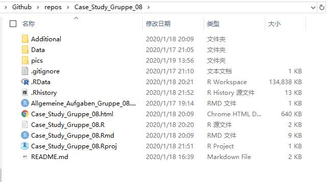

# Case_Study_Gruppe_08

## How to use this repository

the screenshot of origin content of directory  is  shown below:

but  the directory `Data`   will ignored  on  Github because the data files are to large.

so please add data file after you cloned this repository.

the directory `Data` in this  repository(below) is same as the directory  `Data` in [tubcloud]( https://tubcloud.tu-berlin.de/s/QY3zTYfpam2s5nn ):

## the Data we used

| Nr.  | Faktoren                  | directory name       | file name                               | Spezifikation |
| ---- | ------------------------- | -------------------- | --------------------------------------- | ------------- |
| 1    | Zulassungsdatum           | "./Data/Zulassungen" | "Zulassungen_alle_Fahrzeuge.csv"        |               |
| 2    | Fehlerdatum der Fahrzeuge | "./Data/Fahrzeug"    | "Fahrzeuge_OEM1_Typ11.csv"              | Typ11         |
| 3    |                           |                      | "Fahrzeuge_OEM1_Typ12.csv"              | Typ12         |
| 4    |                           |                      | "Fahrzeuge_OEM2_Typ21.csv"              | Typ21         |
| 5    |                           |                      | "Fahrzeuge_OEM2_Typ22.csv"              | Typ22         |
| 6    | Motorisierungsart         | "./Data/Fahrzeug"    | "Bestandteile_Fahrzeuge_OEM1_Typ11.csv" | Typ11         |
| 7    |                           |                      | "Bestandteile_Fahrzeuge_OEM1_Typ12.csv" | Typ12         |
| 8    |                           |                      | "Bestandteile_Fahrzeuge_OEM2_Typ21.csv" | Typ21         |
| 9    |                           |                      | "Bestandteile_Fahrzeuge_OEM2_Typ22.csv" | Typ22         |
| 10   | Fehlerdatum der Motor     | "./Data/Komponente"  | "Komponente_K1BE1.csv"                  |               |
| 11   |                           |                      | "Komponente_K1BE2.csv"                  |               |
| 12   |                           |                      | "Komponente_K1DI1.csv"                  |               |
| 13   |                           |                      | "Komponente_K1DI2.txt"                  |               |

